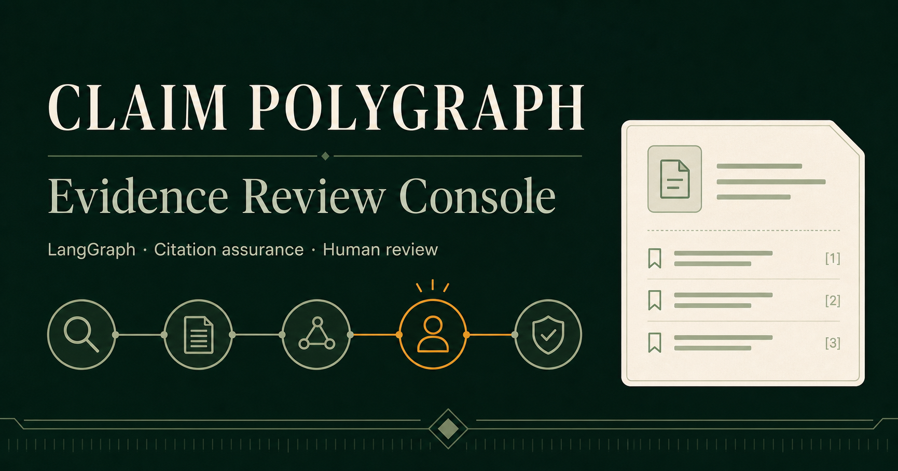
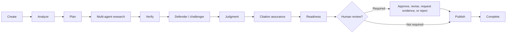
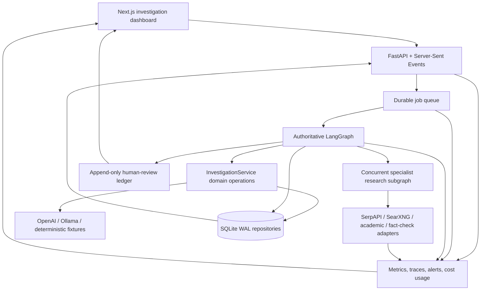

# Claim Polygraph NG

### An auditable, multi-agent evidence investigation system for journalists

[](pyproject.toml)
[](docs/adr/0021-promote-unified-authoritative-langgraph.md)
[](src/claim_polygraph_ng/api.py)
[](dashboard)
[](pyproject.toml)

Claim Polygraph NG investigates factual claims by decomposing the research
problem, assigning bounded specialist roles, retrieving supporting and
contradictory evidence, testing source independence and context, and producing
a citation-audited report for human review.

It is built around a simple principle:

> An AI-generated verdict is not enough. A useful investigation must show the
> evidence, provenance, counterargument, limitations, decision policy, and
> review history behind it.



## Why this project exists

Search engines return documents; language models return answers. Journalists
and researchers need something between them: a recoverable investigation that
can explain where each material assertion came from, whether apparently
independent sources share one origin, what evidence weakens the conclusion,
and why the report is—or is not—safe to publish.

Claim Polygraph NG explores that problem as an end-to-end software system,
not only as a prompt:

- one durable LangGraph thread owns the investigation lifecycle;
- specialist research roles receive typed assignments and hard budgets;
- only approved, persisted evidence can affect downstream reasoning;
- defender and challenger roles independently test the claim;
- deterministic policies constrain verdicts, citations, social evidence, and
  publication;
- human review interrupts and resumes the same graph without replaying
  completed paid work;
- the dashboard exposes progress, evidence, rationale, verification, audit
  results, review history, and operational cost.

## Product walkthrough



1. **Create** — admits an asynchronous durable job and creates a recoverable
   investigation thread.
2. **Analyze** — normalizes the submitted wording into typed, checkable claim
   components without silently changing its meaning.
3. **Plan** — creates explicit requirements for primary, independent,
   contradictory, academic, fact-check, temporal, or numerical evidence.
4. **Multi-agent research** — concurrently routes bounded assignments to
   specialist roles, then deduplicates results and clusters shared origins.
5. **Verify** — checks dates, intervals, quantities, units, historical status,
   and important qualifications.
6. **Defender / challenger** — builds independent cases for and against the
   claim using only approved evidence.
7. **Judgment** — proposes a verdict and constrains it through a deterministic
   label policy.
8. **Citation assurance** — audits material report sentences against exact
   approved passages and blocks unsupported critical claims.
9. **Readiness** — decides whether the packet is sufficiently complete for
   judgment; readiness is not presented as truth probability.
10. **Human review** — pauses the graph for an append-only, identity-bound
    approve, revise, request-evidence, or reject decision.
11. **Publish** — rechecks citation and evidence policy before finalization.
12. **Complete** — persists the final report and immutable investigation
    history.

The internal, developer-oriented description of every stage is maintained in
`docs/private/AUTHORITATIVE_WORKFLOW_STAGE_GUIDE.md` for local project use.

## What makes the implementation interesting

### A genuine bounded multi-agent path

The research workflow is more than a collection of renamed functions.
Primary-source, general-web, academic, fact-check, and challenger researchers
have distinct permissions, adapters, assignments, outputs, and budgets.
Compatible roles fan out concurrently. A sufficiency controller directs
additional rounds only when evidence gain justifies their cost.

The agents do not vote on truth. Their results pass through one authoritative
consolidation boundary, and later stages may use only approved evidence.

### One authoritative, recoverable graph

LangGraph is the default orchestrator. Its nodes call typed
`InvestigationService` operations for research, verification, argument
construction, judgment, citation assurance, review, and finalization.
Checkpointed state survives process restarts and browser disconnections.

The direct sequential composition uses the same domain operations and remains a
tested rollback path.

### Cost-safe external operations

Search, fetch, and model operations use deterministic idempotency scopes and
durable paid-operation receipts. A retry or graph resume checks those receipts
before repeating external work. Research is also bounded by rounds, queries,
page fetches, model calls, tokens, time, and configured cost.

### Evidence independence and provenance

The system distinguishes the number of pages from the number of independent
origins. Syndicated articles, copied passages, explicit citations, and social
reposts are clustered into evidence families so repetition cannot masquerade
as corroboration.

### Social evidence without social-media naïveté

Social platforms are modeled as distribution media, not authority classes.
The system records account attribution, authenticity evidence, post type,
original-source linkage, permitted evidentiary use, availability, and shared
origin. Likes, follower counts, and verification badges never become truth
scores. Unsupported or screenshot-only critical evidence routes to review or
blocks publication.

### Human review as part of the architecture

Review is a durable LangGraph interrupt, not a comment added after generation.
The ledger is append-only and sequence-checked. Approval and revision require a
distinct approver under the current policy, and a revised verdict receives a
new version and citation audit.

## Architecture



### Authority boundaries

- **LangGraph** owns orchestration, branching, checkpoints, interruption, and
  resume.
- **`InvestigationService`** owns domain operations and authoritative
  investigation artifacts.
- **Deterministic policy** owns evidence eligibility, verdict constraints,
  citation blocking, readiness, and publication safety.
- **Models** propose structured analysis; they cannot invent evidence,
  override approved-packet boundaries, or authorize publication.
- **Humans** retain accountability for investigations routed to review.

## Engineering highlights

| Area | Implementation |
|---|---|
| Backend | Python 3.12, FastAPI, Pydantic v2 |
| Orchestration | LangGraph with SQLite-backed checkpoints and interruption |
| Frontend | Next.js 16, React 19, TypeScript |
| Retrieval | SerpAPI, optional SearXNG, safe bounded page fetching |
| Specialist adapters | PubMed/NCBI, Semantic Scholar, Google Fact Check |
| Reasoning providers | Schema-constrained OpenAI, local Ollama, deterministic fixtures |
| Persistence | SQLite WAL repositories for investigations, jobs, graph state, reviews, receipts, and telemetry |
| Live updates | Reconnectable Server-Sent Events using persisted checkpoints |
| Reliability | Idempotent operations, paid-operation receipts, retries, cancellation, backpressure, restart recovery |
| Evidence safety | SSRF/redirect controls, content limits, rights metadata, approved evidence, sentence-level citation audit |
| Observability | Trace continuity across API, jobs, nodes, roles, providers, and reviews |
| Delivery | Multi-service Docker Compose deployment |

## Measured evidence, not a production claim

The project uses frozen benchmarks, release manifests, failure injection, and
Architecture Decision Records rather than declaring a feature complete because
one demo worked.

The accepted Phase 9 release audit recorded:

| Gate | Result |
|---|---:|
| Direct/unified verdict equivalence | 100% across 20 frozen claims |
| Required-review recall | 100% |
| Mean reviewed-evidence coverage | 100% |
| Cases with material challenger gain | 7 |
| Citation support | 100% |
| Duplicate paid operations | 0 |
| Python tests in that release audit | 505 passed |
| Repeated SQLite four-graph stress runs | 8/8 passed |

The Phase 10 social-evidence release audit subsequently recorded:

| Gate | Result |
|---|---:|
| Unsafe adversarial publication rate | 0% |
| Mandatory social-risk review recall | 100% |
| Complete Python regression at that audit | 565 passed |
| Dashboard build, UI/accessibility, and lint gates | Passed |
| Paid provider calls used for the release audit | 0 |

These results validate architecture, control flow, recovery, and safety on the
declared test sets. They do **not** establish population-level factual
accuracy. All 20 Phase 9 benchmark cases requested review, so the routing result
does not establish real-world specificity. The deterministic fixture judge is
intentionally limited, and the current reviewed dataset is too small for
calibrated confidence. Live quality still depends on retrieval quality,
evidence, and human judgment.

See the [Phase 9 final audit](docs/PHASE_9_STAGE_9.13_FINAL_AUDIT.md), the
[Phase 10 final audit](docs/PHASE_10_STAGE_10.9_RECOVERY_SECURITY_AND_PROMOTION.md),
and the accepted [LangGraph](docs/adr/0021-promote-unified-authoritative-langgraph.md)
and [social-evidence](docs/adr/0023-promote-social-evidence-governance.md)
ADRs.

## Run the local product

### Prerequisites

- Docker Desktop with Docker Compose
- a SerpAPI key for the default live-search path
- an OpenAI API key for the default hosted reasoning path

### 1. Configure

Copy `.env.example` to `.env`, then replace the placeholder values:

```dotenv
SERPAPI_API_KEY=your-real-key
OPENAI_API_KEY=your-real-key
CLAIM_POLYGRAPH_SEARCH_PROVIDER=serpapi
CLAIM_POLYGRAPH_MODEL_PROVIDER=openai
CLAIM_POLYGRAPH_ORCHESTRATOR=langgraph
```

`.env` is ignored by Git. Never commit provider credentials.

### 2. Start

```powershell
docker compose up --build
```

Open:

- Dashboard: <http://localhost:3000>
- API health: <http://localhost:8000/health>

Investigation, review, research, checkpoint, job, receipt, and telemetry data
persist in the `claim_polygraph_data` Docker volume.

### 3. Stop

```powershell
docker compose down
```

Do not add `-v` unless you intentionally want to delete the persisted local
volume.

### Optional self-hosted search comparison

```powershell
$env:CLAIM_POLYGRAPH_SEARCH_PROVIDER = "searxng"
docker compose --profile searxng up --build
```

SearXNG remains an optional comparison path; the current local Docker default
is SerpAPI.

## Developer setup

```powershell
python -m venv .venv
.\.venv\Scripts\python -m pip install -e ".[dev]"
.\.venv\Scripts\python -m pytest
.\.venv\Scripts\python -m ruff check .
```

Dashboard checks:

```powershell
Set-Location dashboard
npm ci
npm test
npm run lint
```

The command-line interface uses deterministic synthetic providers by default,
which is useful for zero-cost workflow development:

```powershell
claim-polygraph investigate "The claim to investigate"
claim-polygraph investigate --complex "A compound claim with two assertions"
claim-polygraph extract-claims "An article containing factual statements."
claim-polygraph extract-claims --url "https://example.org/public-article"
claim-polygraph list
claim-polygraph show INVESTIGATION_ID
claim-polygraph evaluate --limit 2
```

Synthetic evidence validates orchestration and contracts; it is not real
fact-checking.

## Safety and privacy boundaries

- Only public, permitted content is fetched; private or restricted material is
  not bypassed.
- PDF retrieval is disabled by default and requires explicit host approval
  after a rights check.
- Safe fetching enforces public-network, redirect, content-type, timeout, and
  response-size policies.
- Full fetched documents and unselected chunks are not retained; the system
  stores bounded evidence passages, metadata, and hashes.
- Retrieved text is treated as untrusted data. Visible prompt-injection text
  remains quoted evidence but cannot authorize tools or override system policy.
- Reviewer identity binding is suitable for the bounded local demo; it is not
  cryptographic authentication.
- Cost displayed in the dashboard is an estimate. SerpAPI plan charges are
  separate, and the aggregate telemetry view may not yet include every model
  usage event from durable jobs.

## Current scope and next engineering steps

This is a **portfolio-grade, bounded single-host system**, not an autonomous or
internet-facing fact-checking service.

The highest-value next steps are:

1. reconcile all paid-operation receipts and trace events into one canonical
   per-investigation cost ledger;
2. expand human evaluation beyond the current 20-claim development benchmark,
   including review-negative cases and more domains;
3. add authenticated, role-based reviewer access before any multi-user
   deployment;
4. move durable jobs and persistence to PostgreSQL when measured concurrency
   exceeds the validated SQLite envelope;
5. evaluate factual calibration only after a sufficiently large held-out
   reviewed dataset exists.

## Repository guide

```text
dashboard/                  Next.js evidence-review dashboard
src/claim_polygraph_ng/
  application/              Authoritative workflows and services
  domain/                   Typed claims, evidence, graph, review, and policy
  providers/                Search, fetch, and reasoning adapters
  persistence/              SQLite repositories, jobs, checkpoints, receipts
  analysis/                 Provenance, verification, quality, and safeguards
  reporting/                Human-readable and machine-readable reports
tests/                      Unit, integration, security, and recovery tests
benchmarks/                 Reviewed claims and adversarial fixtures
artifacts/evaluations/      Versioned evaluation and release-audit outputs
docs/                       Plans, completion reports, and ADRs
```

Start with:

- [Project specification](docs/PROJECT_SPECIFICATION_AND_PLAN.md)
- [Architecture and progress review](docs/PROJECT_PROGRESS_AND_ARCHITECTURE_REVIEW.md)
- [Unified authoritative LangGraph plan](docs/PHASE_9_UNIFIED_AUTHORITATIVE_LANGGRAPH_PLAN.md)
- [Social-media evidence governance plan](docs/PHASE_10_SOCIAL_MEDIA_EVIDENCE_GOVERNANCE_PLAN.md)
- [Benchmark annotation policy](benchmarks/README.md)

## Design decisions

The repository records major decisions as ADRs, including:

- starting with a lightweight vertical slice;
- safe retrieval and rights-aware PDF handling;
- explicit OpenAI and Ollama provider selection;
- cost-first model routing;
- honest non-promotion when an experiment regressed quality;
- LangGraph promotion with a direct rollback;
- retaining SQLite only for the measured local MVP;
- durable jobs, telemetry, human review, and social-evidence governance.

This history is part of the project: unsuccessful experiments are documented
instead of rewritten as successes.

## Author

**Md Moshiur Rahman**

Built as a portfolio project exploring evidence-centric AI systems, durable
multi-agent orchestration, human-in-the-loop review, and trustworthy product
engineering.

## License

Released under the [MIT License](pyproject.toml).
