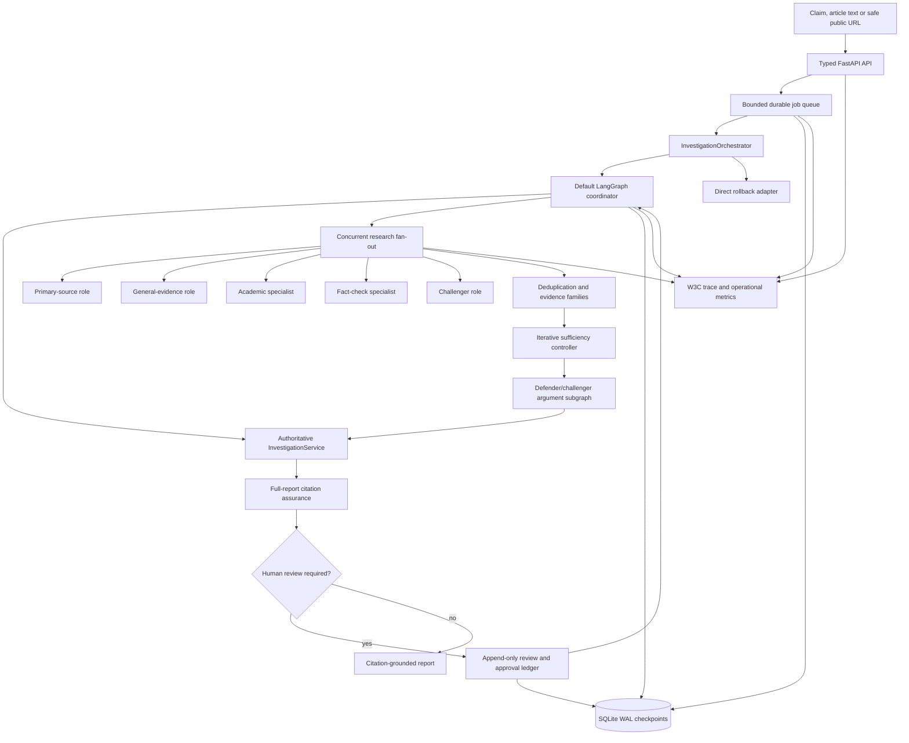

# Phase 8 architecture and operations

Date: 28 July 2026

Status: Complete; observational-default promotion approved

## Released architecture

`InvestigationService` remains the only authority for the approved evidence
packet and verdict. Research agents produce typed candidates. The deterministic
consolidator, sufficiency controller and adversarial reconciler cannot bypass
approved-packet constraints.

## Runtime and rollback

| Concern | Current choice | Production trigger |
|---|---|---|
| Orchestration | LangGraph default | Direct adapter remains tested rollback |
| Relational/checkpoint store | SQLite WAL, single host | PostgreSQL for multi-host writes, HA or operational requirements |
| Durable jobs | Database-backed bounded queue | PostgreSQL leases before considering Redis |
| Distributed broker | Not required | Add only for measured broker throughput or distributed rate limits |
| Similarity index | Not required | Add pgvector only for measured corpus-scale retrieval |
| Telemetry | Local OpenTelemetry-compatible SQLite exporter | OTLP collector/exporter for deployment |
| Confidence | `null` | Require at least 200 leakage-safe reviewed cases and held-out calibration |

## API operations

Core product endpoints include:

- `POST /api/claim-inputs/extract`
- `POST /api/investigations`
- `GET /api/investigations/{id}`
- `GET /api/investigations/{id}/evidence`
- `GET /api/investigations/{id}/report`
- `GET /api/investigations/{id}/events`
- `POST /api/graph-runs`
- `GET /api/graph-runs/{thread_id}`
- `GET /api/graph-runs/{thread_id}/events`
- `GET/POST /api/reviews/...`
- `GET /api/operations/telemetry`
- `GET /api/operations/traces/{trace_id}`

The API accepts W3C `traceparent`; responses continue the trace. Operational
telemetry hashes sensitive claim, prompt, URL, secret and reviewer attributes.

## Measured boundaries

- SQLite: four real writer processes, 200/200 writes, zero lock errors.
- Durable queue: bounded admission, global/provider limits, cancellation,
  retries, dead letters, lease recovery and zero duplicate paid operations.
- Telemetry: API → job → LangGraph → agent → provider continuity.
- Promotion experiment: five-case pilot and ten-case comparison with zero
  authority regressions and full citation/audit coverage.

These measurements establish a bounded single-host portfolio MVP. They do not
claim multi-host production scalability or factual-quality improvement from
synthetic evidence.

## Current decision boundary

The product is genuinely multi-agent in execution: roles receive separate
typed assignments, run concurrently, use bounded permissions, persist separate
results, share caches through controlled operations, and reconcile through
deterministic fan-in.

Multi-agent evidence remains non-authoritative. Stage 8.14 human review approved
observational-default promotion after all five targeted cases were judged
improved. A later live evidence
pilot is required before claiming improved real-world factual accuracy.
