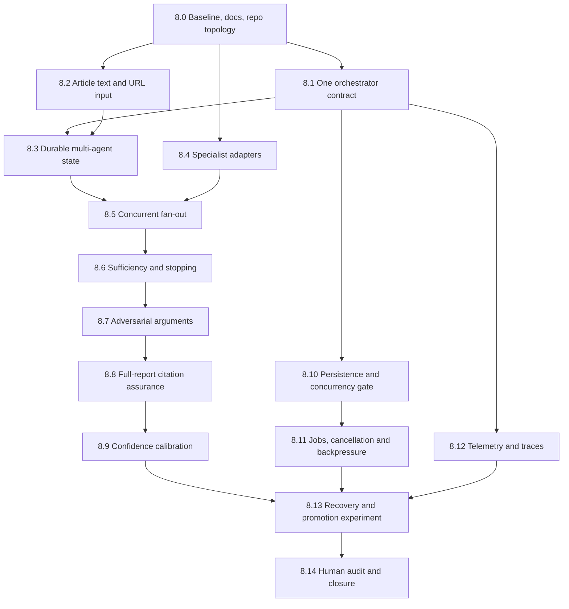

# Phase 8: Promoted LangGraph and Genuine Multi-Agent Research

Date: 28 July 2026  
Status: Planned  
Default orchestrator: LangGraph  
Authoritative research and verdict service: `InvestigationService`  
Rollback: `CLAIM_POLYGRAPH_ORCHESTRATOR=direct`

## Objective

Evolve the promoted LangGraph journey from a durable wrapper into a genuinely
multi-agent research workflow without transferring factual authority away from
the existing investigation service or weakening its evidence, citation,
budget, and review controls.

The phase succeeds only if specialised concurrent roles materially improve
independent evidence-family coverage, contradiction coverage, or reviewed
verdict quality over the authoritative single-coordinator baseline. More
nodes, tokens, or agent messages are not evidence of success.

## Required agent model

| Role | Distinct objective | Tool boundary | Typed output |
|---|---|---|---|
| Coordinator | Decompose requirements, assign work, assess sufficiency, stop or escalate | No unrestricted browsing; dispatch only | Plan, assignments, routing decisions |
| Primary-source researcher | Find controlling official or first-party material | General search plus approved official-source fetch | Research result with source/evidence IDs |
| General evidence researcher | Find independent explanatory and news evidence | General web search and safe fetch | Research result |
| Academic researcher | Find peer-reviewed or authoritative scientific literature | Academic adapters only | Academic research result |
| Fact-check researcher | Find existing professional fact checks | Fact-check adapter only | Fact-check research result |
| Challenger researcher | Seek contradictions, exceptions and missing context | Search/fetch; cannot change verdict | Challenger result |
| Sufficiency controller | Measure coverage, independence, unresolved checks and marginal gain | Stored artifacts only | Continue/stop/escalate decision |

Agents communicate only through versioned typed artifacts in shared durable
state. They cannot invent agent roles, evidence IDs, citations, or tools.

## Scope and efficiency policy

Phase 8 also closes the high-priority product and operational gaps found in the
architecture review. To control time and cost:

- contracts, fixtures, security tests and failure tests precede live calls;
- one product-facing orchestration path is established before new agents;
- each external adapter begins with recorded deterministic responses;
- no paid multi-agent run occurs until the zero-cost graph passes;
- PostgreSQL and a distributed queue are conditional on measured concurrency
  requirements, not installed merely because they appear in the target design;
- confidence calibration is not attempted on the 20-claim set alone;
- dashboard repository restructuring is isolated from feature work; and
- every stage produces a resumable artifact and can close independently.

## Stage dependency map

Stages 8.2, 8.4 and 8.12 can proceed independently after Stage 8.0. Stages
8.10 and 8.11 should not block evidence-quality experimentation unless tests
show that local concurrency is already unsafe.

## Stage 8.0 — freeze promotion, repair documentation and choose repository topology

1. Freeze the accepted ADR 0014, Phase 7 closure, direct rollback and current
   20-case authoritative outputs.
2. Add negative review-routing fixtures so specificity can be measured.
3. Lock quality, latency, token, search, fetch and monetary ceilings.
4. Replace the stale README “current milestone” with an authoritative
   capability/status matrix covering Phases 1–7 and current human-review state.
5. Inventory every dashboard file that belongs in the product release.
6. Adopt a deliberate dashboard source-control strategy:
   - recommended: one root monorepo with `dashboard/` tracked by the root;
   - acceptable alternative: an explicit Git submodule with a pinned commit;
   - do not leave an accidental nested repository.
7. Before changing the nested repository, preserve its branch, commit and
   remote metadata and verify that no dashboard work would be lost.

Exit:

- reproducible baseline and signed experiment manifest;
- README matches actual implementation and benchmark approval state;
- dashboard source-control decision is recorded in an ADR; and
- root and dashboard changes have an atomic release procedure.

Cost: zero model/search calls.

## Stage 8.1 — one promoted orchestration contract

1. Define a typed `InvestigationOrchestrator` protocol.
2. Put promoted LangGraph and direct rollback behind that protocol.
3. Make CLI, API and dashboard declare the selected orchestrator in output.
4. Prove verdict/evidence equivalence and zero duplicate operations.
5. Move the Phase 4 research coordinator behind a LangGraph subgraph adapter;
   do not preserve a second product-facing multi-agent entry path.
6. Route every start, resume, review and report operation through the selected
   orchestrator while retaining `InvestigationService` as authority.

Exit:

- CLI, API and dashboard use one LangGraph path by default;
- `direct` is a tested rollback, not an undocumented alternate product;
- multi-agent research is a replaceable subgraph rather than a parallel
  application design; and
- no operation executes twice during wrapper or rollback tests.

Cost: zero model/search calls.

## Stage 8.2 — article text and public-URL claim extraction

1. Add a typed input union: manual claim, article text, or public article URL.
2. Reuse the safe fetcher for URL input with SSRF, redirect, size, type and
   timeout controls.
3. Record document rights, retrieval time, canonical URL and content hash.
4. Extract candidate factual claims with source-relative offsets and retained
   surrounding context.
5. Rank check-worthiness and let the user select claims before investigation.
6. Treat extraction as analysis only; it must not label truth or silently start
   paid investigations.
7. Add duplicate-claim and context-loss tests.

Exit:

- all three original V1 input types reach the same typed investigation path;
- every extracted claim links to exact input text and context;
- unsafe URLs fail closed; and
- deterministic fixtures pass before one bounded model-backed extraction test.

Cost: at most one approved model smoke call after fixtures pass.

## Stage 8.3 — durable multi-agent graph state

1. Add parent investigation, component, requirement, assignment, result,
   evidence-family, consumption and unresolved-question fields to graph state.
2. Persist only identifiers and bounded summaries in checkpoints.
3. Validate all cross-agent references against stored artifacts.
4. Preserve restart recovery and idempotency.

Exit: graph state can reconstruct a research round without provider calls.

Cost: zero model/search calls.

## Stage 8.4 — dedicated academic and fact-check adapters

1. Define provider-neutral `AcademicSearchProvider` and
   `FactCheckSearchProvider` protocols.
2. Add dedicated adapters for:
   - PubMed/NCBI E-utilities;
   - Semantic Scholar, subject to its current API terms and rate limits; and
   - Google Fact Check Claim Search or a documented equivalent.
3. Normalize all results into the existing source/evidence contracts.
4. Preserve safe fetching, rights controls, dates, retraction/correction
   metadata, provider rate limits and global budgets.
5. Use recorded fixture responses for contracts, pagination, rate limiting,
   empty results and provider failure.
6. Add official/primary-source query shaping without assuming that a domain
   suffix alone establishes authority.

Exit:

- academic and fact-check agents have genuinely different tool permissions and
  result metadata;
- failures degrade to typed unresolved requirements;
- no provider can bypass the safe evidence pipeline; and
- one bounded live call per adapter is allowed only after fixtures pass.

Cost: maximum three live search calls for the stage; no full benchmark run.

## Stage 8.5 — concurrent research fan-out

1. Route the minimum useful role set from typed claim requirements.
2. Execute compatible roles concurrently with per-role and global budgets.
3. Share search/fetch caches to prevent duplicate paid work.
4. Deduplicate and consolidate results after fan-in.
5. Record role-level evidence-family gain, cost and latency.

Exit: concurrent paths are deterministic under fixtures and recover after a
mid-round restart.

Cost: zero paid calls until deterministic recovery passes; then a three-case
frozen or cached pilot.

## Stage 8.6 — iterative sufficiency and diminishing returns

1. Evaluate component coverage, required source types, independent families,
   counterevidence and verification gaps after every round.
2. Activate a new role only for a named unmet requirement.
3. Stop on sufficiency, hard budget, repeated no-gain round, or human-review
   escalation.
4. Cap rounds, calls, pages, tokens, time and cost.

Exit: no unbounded loops and every continuation has an auditable reason.

Cost: zero provider calls for policy tests.

## Stage 8.7 — adversarial argument construction

1. Build defender and challenger arguments independently from approved evidence
   IDs.
2. Prevent either role from searching during argument construction.
3. Reconcile conflicts into the existing typed argument ledger.
4. Send only the approved ledger and verification packet to the authoritative
   judge.

Exit: disagreement is visible and citation-grounded without agent-to-agent
free-form debate.

Cost: use saved evidence packets; at most one model call per role for the
three-case pilot.

## Stage 8.8 — full-report sentence-level citation assurance

1. Represent every material report sentence as a typed assertion before
   rendering prose.
2. Require claim ID, sentence ID, asserted stance, cited evidence IDs,
   materiality and criticality.
3. Audit every material sentence against the approved packet.
4. Fail publication on missing, out-of-packet, contradictory or unresolved
   critical citations.
5. Permit bounded revision of unsupported wording without changing the
   authoritative verdict.
6. Re-audit revisions rather than trusting the revision generator.
7. Measure sentence-level citation precision, completeness, entailment and
   unsupported-statement rate on complete reports.

Exit:

- 100% of material sentences enter the audit;
- at least 95% are fully supported on the locked evaluation;
- no critical unsupported sentence can be finalised; and
- the metric is recomputed from sentence text, not copied from historical
  flags.

Cost: deterministic lexical/structural audit first; semantic model audit only
for ambiguous sentences that pass a predeclared selector.

## Stage 8.9 — empirical confidence calibration

Readiness remains an explanatory feature and must not be renamed confidence.

1. Assemble a sufficiently large calibration set using the reviewed internal
   cases plus compatible public benchmark slices.
2. Freeze features before fitting: evidence quality, independent families,
   contradiction balance, citation assurance, unresolved verification,
   retrieval coverage and model disagreement.
3. Split fitting and evaluation cases to prevent leakage.
4. Compare simple interpretable calibration methods before more complex ones.
5. Report Brier score, expected calibration error, reliability bins, coverage
   under abstention and per-domain/per-label sample sizes.
6. Emit `confidence=null` when sample support is insufficient.
7. Keep confidence observational until it improves calibration without
   worsening abstention or review safety.

Exit:

- confidence is an out-of-sample probability with a versioned calibrator, or
  remains explicitly unavailable;
- readiness remains separately reported; and
- no confidence claim relies only on the 20-case development set.

Cost: no model calls are necessary for fitting; reuse frozen outputs.

## Stage 8.10 — SQLite concurrency gate and persistence decision

1. Define expected MVP concurrency: API workers, active investigations,
   concurrent reviewers and checkpoint writes.
2. Load-test SQLite WAL behaviour, lock timeouts, review sequence checks,
   checkpoint integrity and restart recovery at that target.
3. Measure error rate, P95 write latency and lock contention.
4. If SQLite passes, retain it for the portfolio MVP and document its ceiling.
5. If it fails, implement repository-compatible PostgreSQL migrations and
   repeat the same tests.
6. Do not add pgvector in this stage unless corpus-scale similarity is also a
   measured requirement.

Exit: a recorded keep/migrate ADR supported by load-test evidence; no claim
that SQLite is production-concurrent without evidence.

Cost: local infrastructure only.

## Stage 8.11 — durable jobs, cancellation and backpressure

1. Define a provider-neutral job contract with queued, running, interrupted,
   cancelling, cancelled, completed, failed and retryable states.
2. Add idempotency keys, leases, retry classification and dead-letter
   semantics.
3. Define cancellation at safe node boundaries; preserve completed evidence
   and audit events.
4. Enforce global and per-provider concurrency, queue limits and admission
   backpressure.
5. Implement first with the simplest durable backend compatible with Stage
   8.10.
6. Adopt Redis only if multiple workers or rate-limit coordination require it;
   otherwise retain a database-backed queue.
7. Demonstrate worker crash, lease expiry, retry, cancellation and restart
   without repeated paid operations.

Exit: durable background execution has explicit cancellation and backpressure,
and overload cannot create an unbounded queue or agent loop.

Cost: zero external calls using failure-injection fixtures.

## Stage 8.12 — production telemetry, alerts and distributed traces

1. Define trace/span IDs across API, LangGraph nodes, agents, tools, jobs,
   review actions and reports.
2. Export OpenTelemetry-compatible traces while retaining current audit events.
3. Aggregate latency, token/cost, provider failure, evidence yield, queue wait,
   citation failure, review routing and termination metrics.
4. Add dashboards for mean/P95 latency, cost per investigation/agent, provider
   errors, queue depth and review backlog.
5. Define actionable alerts for provider failure rate, stalled jobs, budget
   exhaustion, citation failures and checkpoint errors.
6. Redact claim text, secrets and optional PII from operational telemetry.
7. Prove one investigation across process boundaries retains a single trace.

Exit: operators can distinguish slow retrieval, provider failure, queue
congestion, agent-loop pressure and review delay without reading raw database
records.

Cost: use a local collector and deterministic traffic first.

## Stage 8.13 — end-to-end recovery and controlled promotion experiment

Demonstrate automatic completion, approval, revision, more-evidence routing,
rejection, specialist escalation, provider failure, process restart and
idempotent resume across multi-agent checkpoints.

Every recovery journey must preserve evidence and repeat no paid operation.

Use a locked staged evaluation:

1. zero-cost fixture suite;
2. five-case frozen packet pilot;
3. only if the pilot gate passes, a ten- or twenty-case comparison;
4. repeat stability only after quality promotion passes.

Compare:

- authoritative single-coordinator workflow;
- LangGraph with the same single-coordinator work;
- LangGraph multi-agent research;
- multi-agent minus challenger;
- multi-agent minus provenance-family routing.

Primary promotion gates:

- zero authoritative regressions;
- material improvement on at least two locked cases or a predeclared
  statistically meaningful evidence-coverage gain;
- improved independent evidence-family or contradiction coverage;
- at least 95% sentence citation support;
- 100% material-sentence audit coverage;
- zero invented/out-of-packet evidence;
- zero duplicate paid operations;
- mean cost no more than 2x baseline;
- median latency no more than 2x baseline;
- deterministic termination in every case;
- review-routing recall remains 100% for mandatory cases and specificity is
  reported on negative controls;
- queue/restart paths preserve trace continuity; and
- confidence, if emitted, passes the frozen calibration gate.

Exit: promote only if quality or evidence adequacy materially improves. A
failed gate keeps the promoted single-coordinator LangGraph path.

## Stage 8.14 — targeted human review and closure

1. Targeted human review of changed outputs.
2. Security, restart, accessibility and artifact-integrity audit.
3. ADR accepting or rejecting multi-agent research as the default subgraph.
4. Hash all inputs, outputs, prompts, schemas and decisions.
5. Publish the SQLite/PostgreSQL decision, job-backend decision, observability
   coverage and remaining operational limits.
6. Verify README, dashboard source-control state, API docs and architecture
   diagrams against the released implementation.

Exit: the repository can state precisely whether the product is genuinely
multi-agent, what benefit it adds, and what it costs.

## High-priority coverage matrix

| High-priority task | Phase 8 owner stage | Completion evidence |
|---|---:|---|
| Article text/URL claim extraction | 8.2 | Three input modes, offset/context tests, safe URL tests |
| Dedicated academic and fact-check adapters | 8.4 | Separate protocols, tools, fixtures and bounded live probes |
| Unify multi-agent research and LangGraph | 8.1, 8.3–8.7 | One orchestrator contract and research subgraph |
| Empirically calibrated confidence | 8.9 | Held-out Brier/ECE/reliability report or explicit null decision |
| Citation assurance for every material report sentence | 8.8 | Full-report assertion coverage and fresh audit metrics |
| Prove SQLite concurrency or migrate | 8.10 | Load report and persistence ADR |
| Durable queue, cancellation and backpressure | 8.11 | Crash/cancel/overload recovery suite |
| Telemetry aggregation, alerts and distributed traces | 8.12 | Trace-continuity test, dashboards and alert rules |
| Repair stale README | 8.0, 8.14 | Capability matrix and release documentation audit |
| Resolve nested dashboard Git repository | 8.0 | Monorepo or explicit submodule ADR and atomic release test |

## Phase 8 completion rule

Phase 8 is complete only when every row in the coverage matrix is either:

- implemented and verified;
- deliberately retained with a passed evidence-based gate, such as SQLite; or
- rejected by an ADR with a tested safe fallback.

Multi-agent promotion and Phase 8 completion are separate decisions. The phase
may close with a negative multi-agent promotion result if the experiment is
valid, the single-coordinator LangGraph fallback remains safe, and all other
high-priority product gaps have explicit dispositions.
