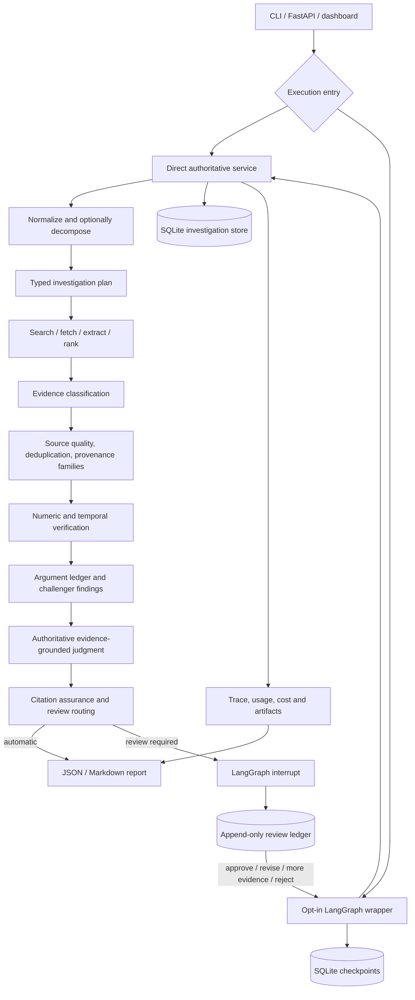
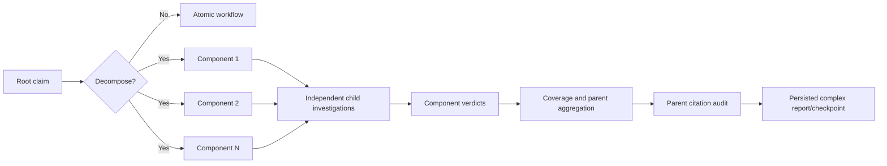
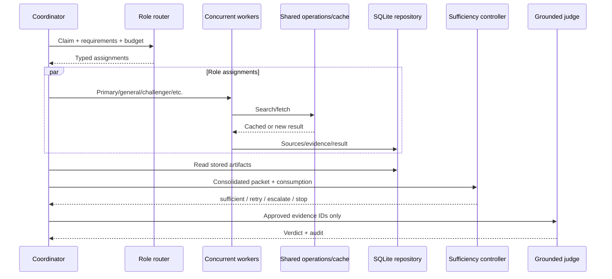

# Claim Polygraph NG: Project Progress and Architecture Review

> **Phase 8 reconciliation — 28 July 2026:** This document originally captured
> the pre-Phase-8 architecture. Its historical analysis remains useful, but
> statements that LangGraph and multi-agent research are separate, SQLite
> concurrency is untested, durable jobs are absent, telemetry is absent, or the
> dashboard is a nested repository are now superseded. Stages 8.0–8.13 unified
> orchestration, added typed durable multi-agent state, specialist adapters,
> concurrent research and adversarial subgraphs, full-report citation
> assurance, measured SQLite WAL concurrency, bounded durable jobs, W3C trace
> continuity and a controlled promotion experiment. LangGraph is the default;
> `InvestigationService` remains authoritative; multi-agent candidate evidence
> is promoted as the default observational research subgraph following Stage
> 8.14 human review; InvestigationService remains authoritative. See
> `PHASE_8_ARCHITECTURE_AND_OPERATIONS.md` and the Stage 8 completion reports
> for the current released design.

Date: 28 July 2026  
Review basis: original 28-page project plan, repository implementation, ADRs,
phase closure artifacts, benchmark artifacts, tests, API, LangGraph workflow,
review ledger, and dashboard.

## Executive verdict

The project is on the right track, but it has not yet reached the complete
multi-agent product described in the original plan.

Its strongest result is not “many agents.” It is an unusually disciplined,
evidence-first core: typed artifacts, bounded retrieval, selective
decomposition, source-quality and provenance analysis, numerical and temporal
checks, constrained judgment, sentence-level citation assurance, immutable
review history, reproducible evaluation, and honest non-promotion of
experiments that failed their gates.

The current product is best described as:

> A mature, modular investigation engine with an experimental bounded
> multi-agent research path and an engineering-complete, opt-in LangGraph
> orchestration and review shell.

It is not yet:

> The original plan's fully promoted supervisor-based multi-agent workbench
> with specialised retrieval agents, calibrated confidence, production
> persistence, deployed API, complete observability, and broad external
> benchmark evidence.

No wholesale refactor is justified. The domain contracts and evidence-first
boundaries should be kept. Before adding another large feature phase, the
project should close the pending LangGraph promotion decision, correct the two
known benchmark disagreements, consolidate the default execution path, and
turn the local demonstration into a deployable, authenticated product slice.

## 1. Overall architecture

### 1.1 Current logical architecture



The diagram contains two important authority boundaries:

1. `InvestigationService` and `ComplexInvestigationService` remain the
   authoritative research and verdict implementations.
2. LangGraph coordinates state, checkpoints, interruptions, resume, and review;
   it does not replace the underlying evidence or verdict logic.

The Phase 4 `MultiAgentInvestigationService` is a separate experimental branch.
It is implemented, typed, concurrent, resumable, budgeted, and grounded, but
ADR 0012 explicitly keeps the Phase 3 single-coordinator workflow as the
default because the multi-agent pilot improved only one of three cases, below
the declared two-case promotion threshold.

### 1.2 Runtime layers and interaction

| Layer | Current responsibility | Interaction and critical assessment |
|---|---|---|
| Interfaces | CLI, typed FastAPI API, Server-Sent Events, React dashboard | The API and dashboard expose real investigation and review state. The hosted dashboard still needs a publicly reachable HTTPS API for a fully deployed product. |
| Orchestration | Promoted LangGraph graph, direct rollback, experimental multi-agent coordinator | The authority separation protects the tested core. Phase 8 must unify these behind one protocol and integrate research roles as typed subgraphs. |
| Domain contracts | Pydantic claims, plans, evidence, source, provenance, verification, judgment, graph, review, API and trace models | This is the architectural foundation and should be retained. Protected identifiers and validation reduce model authority. |
| Retrieval | SearXNG and SerpAPI adapters, safe fetcher, HTML/text/PDF extraction, passage ranking | Real and replayable retrieval exists. SearXNG reliability was weak in local use; SerpAPI became the practical live path. Academic and fact-check-specific adapters remain absent. |
| Reasoning providers | Deterministic mock, Ollama, OpenAI structured-output adapters with task routing | Provider separation, versioned prompts and strict schemas are sound. The system uses a shared worker prompt plus task instructions, not autonomous free-form agents. |
| Evidence intelligence | Relevance/stance, quality scoring, canonicalisation, exact/near duplicates, provenance links, evidence families, independence features | This closely implements the project's central differentiator. Some provenance relationships are heuristic or model-assisted, so their uncertainty must remain visible. |
| Verification and judgment | Numeric/temporal checks, argument ledger, challenger findings, judgment policy, readiness, verdict and citation audit | Verification artifacts are useful. The deterministic judgment policy correctly remains observational after reducing benchmark accuracy from 90% to 65%. |
| Persistence | SQLite repositories for investigations, research operations, LangGraph checkpoints and append-only review records | Appropriate for the current local-first stage. It is not yet the PostgreSQL/pgvector/Redis production architecture from the plan. |
| Evaluation | Frozen 20-claim benchmark, retrieval/page/semantic evaluations, phase gates, ablations, recovery journeys, artifact hashes | Strong reproducibility and cost discipline. Twenty hand-built claims are too small and homogeneous for final quality or calibration claims. |
| Reporting and audit | JSON/Markdown reports, trace events, citation assurance, review revisions and approval records | Strong audit trail. Citation assurance is strongest for concise verdict sentences; it is not yet demonstrated for every material sentence in a long generated report. |

### 1.3 End-to-end workflow

#### Atomic claim

1. The user submits an English claim through the CLI or API.
2. Runtime policy chooses deterministic, Ollama, or OpenAI reasoning and mock,
   SearXNG, SerpAPI, or frozen retrieval.
3. The claim is normalised into a typed `AtomicClaim`; meaning, quantities,
   geography, date, ambiguity and check-worthiness are retained.
4. A typed plan selects research paths, source expectations, verification
   flags and hard budgets.
5. Search returns candidates. Safe fetching blocks private-network and unsafe
   targets, limits redirects and size, and applies explicit PDF-rights policy.
6. Documents are converted to bounded chunks and ranked passages. Only bounded
   evidence passages, metadata and hashes are retained.
7. Evidence is classified against the exact claim. Application code, not the
   model, owns IDs, offsets and provenance.
8. Source-quality, dependency, duplicate and evidence-family analysis reduce
   false source diversity.
9. Numerical and temporal verifiers create typed diagnostic artifacts.
10. The argument ledger maps claims to supporting, contradicting, qualifying
    and contextual evidence.
11. The authoritative judge receives the approved evidence packet and cannot
    browse. The newer deterministic policy may propose a candidate but cannot
    overwrite the verdict.
12. Citation assurance checks the verdict sentence and deterministic review
    routing decides whether interruption is required.
13. The system persists artifacts, events, usage and reports.
14. When the LangGraph path is used, a review-required case checkpoints and
    interrupts. Reviewer actions append decisions, distinct approvals,
    revisions or further-research requests and then resume idempotently.

#### Complex claim



Decomposition is selective and protects context. Components receive durable
child investigations, and completed child work is reused on resume. This is
more than string splitting; however, parent aggregation remains a known
semantic risk, as shown by the corrected CPNG-014 rule.

#### Experimental multi-agent research

The coordinator converts requirements into role assignments. Compatible
assignments run concurrently through a shared, cached operations boundary.
The current roles are primary-source, general-evidence, challenger, and
conditionally academic or fact-check. Results are persisted, deduplicated,
consolidated into evidence families, tested for sufficiency, and passed to a
grounded deterministic verdict builder. Roles do not talk directly to each
other; they communicate through typed artifacts and repository state.

## 2. Feature inventory

Status meanings:

- **Complete**: implemented, tested, and used by an authoritative or accepted
  workflow.
- **Experimental/partial**: implemented and tested but opt-in, observational,
  narrowly evaluated, or not production-integrated.
- **Missing**: required by the original plan but not materially implemented.

### 2.1 Input, claims and planning

| Feature | Purpose | Status | Assessment |
|---|---|---:|---|
| Manual English claim input | Start an investigation | Complete | CLI and API supported. |
| Claim normalisation | Preserve exact factual meaning and context | Complete | Typed and schema-constrained. |
| Check-worthiness metadata | Avoid researching non-factual text | Partial | A score exists, but there is no mature extraction/ranking product flow. |
| Article-text ingestion | Extract claims from supplied articles | Missing | Original V1 scope is not met. |
| Public URL ingestion/content extraction | Fetch an article and offer claims | Missing | Fetching exists for evidence, not as a user-input claim-extraction flow. |
| Selective decomposition | Split only independently checkable assertions | Complete | Context and parent links are validated; complex benchmark exists. |
| Investigation planning | Define paths, checks and budgets | Complete | Model proposal is bounded and policy-enforced. |
| Dynamic ambiguity clarification with user | Resolve materially different interpretations | Missing/partial | Ambiguity is recorded and can route to review, but no interactive clarification step exists. |

### 2.2 Retrieval and evidence

| Feature | Purpose | Status | Assessment |
|---|---|---:|---|
| Search-provider abstraction | Avoid provider lock-in | Complete | SearXNG and SerpAPI adapters plus snapshots. |
| Supporting and contradictory retrieval | Reduce confirmation bias | Complete | Separate paths and challenger role exist. |
| Primary-source retrieval | Prefer controlling evidence | Partial | A routed path exists, but not a domain-specific primary-source adapter. |
| General web/news research | Find broad evidence | Complete | Search-backed implementation. |
| Existing fact-check research | Reuse professional fact checks | Partial | Role exists; dedicated Google Fact Check API adapter is absent. |
| Academic research | Find scientific literature | Partial | Conditional role exists; NCBI/Semantic Scholar adapters are absent. |
| Safe URL fetching | Prevent SSRF and unsafe downloads | Complete | Security-tested and bounded. |
| HTML/text extraction | Produce retrievable text | Complete | Script content is stripped and passage extraction is tested. |
| Rights-aware PDF retrieval | Avoid unauthorised downloading/storage | Complete within chosen scope | Disabled by default; explicit host approval; extraction ceilings; no OCR. |
| Passage ranking | Select relevant bounded text | Complete | Deterministic lexical ranking plus bounded semantic comparison. |
| Passage offsets/provenance | Make evidence reproducible | Complete | Application-owned IDs and offsets fix the earlier model-output defect. |
| Search/fetch/model operation cache | Avoid duplicate paid work | Complete | Stage 7 recovery reports zero repeated operations. |

### 2.3 Source intelligence

| Feature | Purpose | Status | Assessment |
|---|---|---:|---|
| Source-quality dimensions | Expose authority and risk rather than one opaque score | Complete | Calibrated in Phase 5 and represented as features. |
| URL canonicalisation | Collapse URL variants | Complete | Deterministic. |
| Exact duplicate detection | Remove identical sources | Complete | Hash/identity based. |
| Near-duplicate detection | Detect copied or lightly changed material | Complete | Heuristic and evaluated on fixtures. |
| Provenance links | Express derivation/citation relationships | Complete/partial | Typed and model-assisted; real-world relationship accuracy needs a larger gold set. |
| Evidence families | Count independent origins, not URLs | Complete | The main differentiator is implemented and surfaced. |
| Independence/readiness features | Inform sufficiency and review | Complete | Used as auditable features, appropriately not claimed as calibrated probability. |
| pgvector similarity/clustering | Scale semantic matching | Missing | Deliberately deferred; current datasets do not justify it yet. |

### 2.4 Verification, judgment and reporting

| Feature | Purpose | Status | Assessment |
|---|---|---:|---|
| Numerical verification contracts | Check values, units, tolerance and exactness | Complete as deterministic subsystem | Fixture accuracy is 100%; automatic extraction from arbitrary web evidence remains limited. |
| Temporal verification | Check dates, intervals, status and retrospective leakage | Complete as deterministic subsystem | Fixture accuracy is 100%; still dependent on supplied structured facts. |
| Typed argument ledger | Trace evidence for and against each assertion | Complete | Strong basis for explainability. |
| Challenger findings | Surface unresolved counterarguments | Complete | Deterministic, not a separately deliberating agent. |
| Prosecutor/defender debate | Adversarial synthesis before judgment | Partial | Ledger/challenger semantics cover the function; the planned two-role debate protocol is not implemented. |
| Nuanced verdict taxonomy | Avoid binary true/false output | Complete | Eight labels and explicit overlap policy. |
| Evidence-constrained judge | Prevent browsing or invented evidence | Complete | Approved IDs are enforced. |
| Deterministic judgment-policy matrix | Restrict unsafe labels | Experimental, not promoted | Correctly observational after five regressions. |
| Calibrated confidence | Quantify empirical reliability | Missing | Confidence is intentionally null; readiness features are not calibration. |
| Sentence-level citation audit | Detect unsupported material statements | Complete for current verdict sentence | Long-report, every-sentence coverage is not yet demonstrated. |
| Citation revision loop | Repair a partially supported sentence | Partial | Suggested revisions and review revisions exist; no broadly evaluated automatic multi-sentence loop. |
| JSON and Markdown reports | Deliver inspectable outputs | Complete | Current report format is useful and reproducible. |

### 2.5 Orchestration, review and product surface

| Feature | Purpose | Status | Assessment |
|---|---|---:|---|
| Async bounded execution | Parallelise I/O within budgets | Complete | Research roles use bounded concurrency. |
| Genuine role assignments | Separate objectives and tool paths | Experimental | Phase 4 exists but failed its promotion-benefit gate. |
| Evidence-sufficiency routing | Stop, retry or escalate based on evidence | Complete in experimental path | Bounded and typed; one-round implementation is less dynamic than the original vision. |
| Diminishing-return stopping | Stop costly low-yield loops | Partial | Gain and budget contracts exist, but no deeply exercised iterative research loop. |
| LangGraph typed state | Explicit graph orchestration | Complete and promoted | Approved on 28 July 2026; the direct workflow remains rollback. |
| SQLite LangGraph checkpoints | Restart and resume | Complete | Real interrupt and idempotent recovery tested. |
| Human review routing | Interrupt risky or insufficient cases | Complete/partial | Recall is 100% on the frozen set, but all 20 cases required review, so specificity is unknown. |
| Immutable review history | Preserve decisions and revisions | Complete | Append-only hash chain, optimistic sequence checks, distinct approver enforcement. |
| Review actions | Approve, revise, request evidence, reject | Complete | Recovery journeys cover all declared paths. |
| Escalate to domain specialist | Handle specialised high-risk cases | Missing | No specialist assignment product flow. |
| Typed FastAPI surface | Expose investigations, graph, evidence, review and reports | Complete for Stage 7 scope | Not the exact original API and not yet production deployed. |
| SSE progress | Show live execution | Complete | One-way progress matches the V1 design. |
| Connected dashboard | Visible evidence/review workspace | Complete as demo | Static fixtures were replaced with typed API data; production API connection remains unresolved. |
| Real authentication/RBAC | Bind actions to trusted reviewers | Missing | Header identity checks are boundary validation, not authentication. |
| PostgreSQL/Redis/job queue | Concurrent production operation | Missing | SQLite is an intentional lightweight substitute, but multi-process scale is not ready. |
| Hosted end-to-end application | Portfolio-ready public demo | Partial | Dashboard is hosted; backend is local. |

### 2.6 Evaluation, security and operations

| Feature | Purpose | Status | Assessment |
|---|---|---:|---|
| Frozen 20-claim benchmark | Regression and phase-gate evidence | Complete | All cases have human review, but size and diversity limit generalisation. |
| Retrieval quality evaluation | Separate search from reasoning quality | Complete | Recall, pages, semantic passage recovery and snapshot replay are measured. |
| Baselines and ablations | Justify added complexity | Partial/strong | Single vs multi-agent and judgment-policy gates are excellent; public-dataset and several planned ablations are absent. |
| Multi-agent cost/latency gate | Prevent complexity without benefit | Complete | This gate correctly blocked promotion. |
| Recovery-path testing | Prove restart and review behaviour | Complete | Eight journeys pass. |
| Artifact hashing | Freeze release evidence | Complete | Phase 6 and 7 manifests are hash-audited. |
| Prompt-injection boundaries | Treat retrieved text as untrusted | Complete at core boundaries | Static pattern stripping is not a complete defence, but tool/authority separation is sound. |
| SSRF protections | Block private targets and rebinding risks | Complete/tested | One of the stronger production-oriented parts. |
| Secret handling | Keep keys out of CLI, traces and frontend | Complete for tested paths | Formal secret scanning is not present. |
| Cost/token telemetry | Measure model usage | Complete | Version, token, latency and estimated cost are recorded. |
| Production observability | P95, provider dashboards, distributed traces and alerts | Missing/partial | Trace records exist; operational aggregation and OpenTelemetry do not. |
| CI/CD and container release | Reproducible delivery | Missing | No root Docker Compose or evident CI workflow. |
| Accessibility | Make dashboard usable | Partial | Structural checks pass; no full WCAG or assistive-technology test. |
| Security dependency scanning | Find known vulnerabilities | Missing | `pip check` is consistency checking, not vulnerability scanning. |

## 3. Workflow analysis

### 3.1 Data and decision flow

The system correctly separates facts from decisions:

```text
untrusted user/web data
  -> typed claim and source records
  -> bounded passages with protected provenance
  -> semantic evidence classifications
  -> deterministic quality/dependency/verification features
  -> approved evidence packet
  -> provisional verdict
  -> citation assurance
  -> deterministic review routing
  -> append-only human decision and approval
  -> versioned authoritative output
```

The application owns identifiers, offsets, source links and approval state.
Models contribute bounded semantic fields. This is a better safety boundary
than allowing an agent to create citations or silently fetch evidence during
judgment.

Decision authority is intentionally split:

- model tasks may normalise, decompose, classify, judge and audit;
- deterministic policy enforces schemas, budgets, tool access and invariants;
- the existing judge remains verdict authority;
- the failed Phase 6 policy is diagnostic only;
- LangGraph owns orchestration state, not factual authority;
- named reviewers and distinct approvers own final review decisions.

### 3.2 Failure and recovery flow

Provider failures become structured failures rather than evidence. A failed
fetch moves to the next candidate within budget. Completed operations are
cached. LangGraph checkpoints before human interruption, and resume reuses the
authoritative report rather than repeating provider calls. Stale or conflicting
review actions are rejected by sequence and identity rules. This is a robust
implementation of durability for a single-node SQLite deployment.

The remaining reliability gap appears under concurrent production load:
SQLite locking, in-process SSE state, lack of a durable queue, and lack of
multi-worker coordination have not been proven.

## 4. Multi-agent evaluation

### 4.1 Is it genuinely multi-agent?

There are two valid answers depending on scope.

**At repository level: yes, an experimental bounded multi-agent subsystem
exists.** It has typed role assignments, distinct goals, routed research paths,
parallel execution, per-role results, shared cached operations, consolidation,
sufficiency assessment, budgets and resumable state. This is more than giving
several modules agent names.

**At product/default-workflow level: no, the current system is not yet a
promoted multi-agent product.** ADR 0012 keeps the single-coordinator Phase 3
workflow as default because the experiment did not demonstrate enough material
quality gain. LangGraph adds genuine graph orchestration and human interruption,
but its nodes wrap the authoritative service; LangGraph itself does not turn
the default research engine into a team of specialised agents.

### 4.2 Communication and coordination

Agents do not exchange natural-language messages. They communicate indirectly:



This artifact-mediated design is preferable to uncontrolled agent chat:
communication is inspectable, idempotent and testable. Direct inter-agent
conversation is not required for genuine multi-agent behaviour.

### 4.3 Architectural gaps

1. Role specialisation is shallow. Most roles use the same worker and provider;
   their main difference is a path label, query prefix and expected stance.
2. Primary, academic and fact-check roles lack dedicated tools and retrieval
   contracts promised in the original plan.
3. The coordinator mostly preassigns work. It does not repeatedly reconsider
   strategy from newly discovered evidence in a well-evaluated bounded loop.
4. The prosecutor/defender “debate” is represented by an argument ledger and
   challenger findings, not two independent argument-building roles with a
   conflict-resolution contract.
5. There is no measured per-role marginal contribution beyond the small Phase
   4 pilot; the academic role showed no case-level benefit.
6. Shared context is a repository packet, but there is no explicit,
   versioned cross-agent belief or unresolved-question state.
7. The multi-agent path is separate from the promoted LangGraph wrapper.
   Integrating both without duplicating orchestration requires a single
   coordinator interface.
8. Most importantly, the system has not met the original success condition:
   material improvement over the single-agent baseline.

The correct response is not to add more agent personas. It is to improve role
specialisation and measure marginal evidence-family coverage per dollar.

## 5. Prompt analysis

### 5.1 Prompt architecture

There is no single giant prompt implementing the whole workflow. Both Ollama
and OpenAI use the same two-level design:

1. a short, versioned shared system prompt; and
2. a task-specific instruction selected by `ModelTask`, followed by input JSON
   and the required JSON Schema.

This is materially aligned with the typed, bounded architecture. The OpenAI
version is `openai-responses-structured-v13`; the Ollama version is
`ollama-structured-v10`. The separate benchmark review procedure records
`ai-benchmark-review-v2`.

### 5.2 Every task prompt

| Prompt/task | Responsibility | Assessment |
|---|---|---|
| Shared bounded-worker system prompt | Treat claims/passages/metadata as untrusted data; use only supplied input; return schema-valid JSON; do not browse, call tools or invent citations | Strong and concise. It accurately limits model authority. Provider copies should derive from one constant to prevent drift. |
| `NORMALIZE_CLAIM` | Preserve meaning; extract type, entities, quantities, date, geography, ambiguity and check-worthiness; make no verdict | Clear separation of analysis from research. “Without changing meaning” needs semantic regression examples, which partly exist in benchmarks. |
| `DECOMPOSE_CLAIM` | Selectively split material assertions while preserving context and causal structure | Thorough but long and rule-heavy. It contains accumulated benchmark-specific corrections. Convert invariants that can be deterministic into validators, leaving the prompt focused on semantic choices. |
| `PLAN_INVESTIGATION` | Propose bounded paths and source types | Efficient, but underspecified about why a specialist is required. Add typed rationale fields rather than more prose. |
| `CLASSIFY_EVIDENCE` | Classify exact passage meaning, ignore path label, protect provenance, respect universal terms | Strong. The task combines stance, relevance, entailment, temporal compatibility and context; calibration should be measured separately per field. |
| `CLASSIFY_PROVENANCE_RELATIONSHIP` | Decide likely derivation vs independence from two stored packets only | Correctly conservative. Pairwise comparison will become expensive at scale and should follow deterministic candidate generation. |
| `JUDGE_EVIDENCE` | Apply the nuanced taxonomy to approved evidence only and disclose uncertainty | Responsible but overloaded. It contains taxonomy, precedence rules, many special cases and benchmark-derived exceptions. This is the highest prompt-maintenance risk. Move stable taxonomy and precedence to a versioned policy artifact supplied as data, not duplicated prose. |
| `AUDIT_SENTENCE` | Judge whether evidence supports the exact verdict sentence and propose a conservative revision | Well scoped and explicitly distinguishes sentence support from claim truth. Parent aggregation instructions make it complex; atomic and parent-audit schemas should be separated if error analysis shows confusion. |
| `REVIEW_ANNOTATION` | Produce a provisional packet-only benchmark annotation | Transparent and correctly refuses to claim URL access. It must remain evaluation-only and never be presented as human review. |
| `REVIEW_CRITIQUE` | Independently challenge the provisional annotation | Useful second pass, but it uses the same provider family and underlying evidence, so “independent” means role separation, not independent human or model evidence. |
| `EVALUATE_PASSAGE` | Compare a retrieved passage with a reviewed evidence target without rejudging the claim | Appropriate for semantic retrieval evaluation. It should never enter the production verdict path because it uses gold target information. Current separation appears correct. |

### 5.3 Redundancy, conflict and inefficiency

- OpenAI imports the task instructions defined in the Ollama module. Sharing
  content is good, but locating the canonical prompt registry inside one
  provider is an architectural smell. Prompts should live in a provider-neutral
  module with independent versions or hashes.
- The shared system prompt is duplicated between providers and can drift.
- The judge prompt mixes stable label definitions with case-specific
  precedence heuristics. Phase 6 showed why prose rules are not equivalent to
  a correct semantic representation.
- Several application calls add extra `requirements` or
  `taxonomy_guidance`. These are useful but form an implicit second prompt
  layer whose versions are not as visible as the provider prompt version.
- The decomposition and judge prompts encode fixes discovered from a 20-case
  benchmark. This risks overfitting while still appearing general.
- Prompt versions are recorded, but there is no single manifest mapping prompt
  version, source hash, schema version, model route and benchmark result.
- Repair behaviour is largely schema validation and bounded failure handling;
  the original plan's explicit one-repair prompt is not clearly represented as
  a first-class, evaluated prompt.

### 5.4 Prompt recommendations

Keep the bounded system prompt, task separation, JSON Schema, untrusted-data
boundary and application-owned provenance. Centralise prompt definitions,
hash the exact system/task/template combination, version injected policy data,
and add task-level regression suites. Do not make prompts more agent-like or
more verbose. Prompt optimisation should reduce responsibilities per call and
move mechanically enforceable constraints into code.

## 6. Master prompt analysis

The current runtime “master prompt” is the shared bounded-worker system
message, not the original plan document and not a hidden all-purpose agent
prompt.

### Purpose

It establishes the global trust and authority boundary for every structured
reasoning call: external content is data, the model must remain within the
supplied packet, output must follow the requested schema, and the model may not
browse, call tools or invent citations.

### Responsibilities defined

- establish the model as a bounded analysis worker;
- classify all supplied claim/evidence content as untrusted;
- prohibit instruction following from retrieved content;
- prohibit independent retrieval and tool use;
- require packet-only reasoning;
- require schema-only structured output; and
- prohibit fabricated citations.

### Implemented features covered

It governs claim normalisation, selective decomposition, planning, evidence
classification, provenance classification, judgment, citation audit, AI
review and semantic-passage evaluation. It directly reflects prompt-injection
defence, typed tool/model contracts, evidence-first judgment and citation
provenance.

### Architecture reflected

The prompt accurately reflects the model layer's intended place beneath
application policy. Search/fetch happens in trusted application tools;
identities and offsets belong to application code; the judge sees an approved
packet; Pydantic validates outputs.

### Alignment and gaps

It aligns well with the actual default system, but it does not represent the
complete architecture—and should not attempt to. It says nothing about agent
roles, budgets, routing, evidence sufficiency, persistence, review, numerical
tools, source independence, cost controls or LangGraph. Those responsibilities
correctly reside in code and typed state rather than a master prompt.

The inconsistency is terminological: calling this a “master prompt” may imply
that it coordinates the whole multi-agent system. It does not. It is a shared
worker safety prompt. The actual master policy is distributed across domain
schemas, runtime policy, task instructions, deterministic analysis and graph
routing. That distribution is architecturally sound but needs a documented
policy map and unified version manifest.

No rewrite is recommended in this review.

## 7. Gap analysis and scalability risks

### Critical before the next large phase

1. **Orchestration consolidation:** ADR 0014 is accepted and the API defaults
   to LangGraph, but CLI/API/dashboard should converge on one explicit
   `InvestigationOrchestrator` contract during Phase 8.
2. **Two known authoritative errors:** CPNG-006 and CPNG-019 keep benchmark
   accuracy at 90%. Wrapping the workflow preserved, rather than fixed, them.
3. **Routing specificity is unknown:** all 20 frozen cases require review.
   A system that routes everything to humans has perfect recall but limited
   automation value.
4. **Dashboard/backend deployment gap:** the visible frontend is hosted, but a
   public HTTPS API is absent. Local HTTP cannot be the production backend for
   a hosted HTTPS dashboard.
5. **No real identity security:** reviewer header matching and distinct
   approver logic are valuable integrity checks, not authentication or RBAC.

### High priority

- Article text/URL claim extraction is absent despite original V1 scope.
- Academic and fact-check roles lack dedicated adapters.
- Multi-agent research and LangGraph orchestration are parallel designs rather
  than one promoted path.
- No empirically calibrated confidence; readiness is not probability.
- Citation assurance is not proven over every material sentence in a full
  report.
- SQLite is not proven for multi-process workers or high review concurrency.
- No durable distributed job queue, cancellation semantics or backpressure.
- No production telemetry aggregation, alerts, or distributed traces.
- README “current milestone” is stale and understates Phases 4–7 while parts of
  its benchmark annotation text also lag later human review.
- The dashboard is a nested Git repository. This explains confusing root source
  control visibility and complicates atomic releases.

### Medium priority

- The custom 20-claim benchmark is too small for macro-F1, confidence
  calibration, role contribution or domain-general conclusions.
- Planned AVeriTeC, FEVER, SciFact and ClaimDecomp evaluations are absent.
- Pairwise model-assisted provenance classification will grow quadratically
  unless candidates are prefiltered.
- Long retained passages and repeated packet serialisation may increase token
  cost before pgvector or compression becomes necessary.
- Prompt-policy provenance is split across task instructions and call-site
  additions.
- There is no full accessibility audit, dependency vulnerability scan, load
  test, chaos test, retention/deletion implementation, Docker release or CI/CD.

### Things that are intentionally not gaps yet

PostgreSQL, Redis and pgvector were deliberately deferred to prevent
infrastructure from dominating evidence-quality work. That decision was
correct. They become necessary only when the product introduces multiple API
workers, concurrent reviewers, durable background jobs, much larger evidence
collections, or semantic retrieval at scale.

## 8. Phase readiness assessment

### Direction

The project is directionally strong. It follows the original plan's most
important engineering principle: complexity must earn promotion through
measured quality. The decision not to promote Phase 4 multi-agent research and
Phase 6 deterministic judgment is evidence of good architecture governance,
not failure.

### Maintainability

The typed domain models, provider protocols, repositories, deterministic
analysis functions, ADRs and tests are maintainable. Risks are accumulating in
three areas:

- multiple orchestration paths;
- prompts/policy spread across providers and call sites; and
- a nested frontend repository with separate deployment state.

These call for targeted consolidation, not a rewrite.

### Extensibility

Adding a provider, verification artifact or review rule is straightforward.
Adding production concurrency or a genuinely specialised research agent is
harder because persistence and orchestration boundaries have not yet been
unified behind production interfaces.

### Scalability

The design is logically scalable, but the current deployment is not
operationally scalable. SQLite, local SSE and an undeployed API are suitable
for a portfolio vertical slice, not a multi-worker service. PostgreSQL and a
durable job mechanism should be introduced when the next phase explicitly
tests concurrency; Redis and pgvector should remain conditional.

### Recommendation

Proceed with the current design after a short consolidation gate. Do not start
a broad new “more agents” phase and do not perform a full refactor. Promote or
reject LangGraph explicitly, fix the two benchmark errors, measure review
specificity on negative cases, and deploy one authenticated end-to-end path.

## 9. Recommendations

### Keep

- Typed Pydantic contracts and application-owned provenance.
- Evidence-first judgment with no judge browsing.
- Safe fetching and explicit PDF-rights approval.
- Source-family and independence analysis as the central differentiator.
- Frozen artifacts, hashes, phase gates and ADR-based promotion.
- Deterministic fixtures and snapshot replay for zero-cost regression.
- Provider abstraction and explicit paid-model opt-in.
- LangGraph checkpoint/interrupt/recovery implementation.
- Append-only review history with distinct approval.
- Honest failed-gate reporting.

### Improve

- Unify direct, LangGraph and multi-agent orchestration behind one interface.
- Centralise and hash prompts and injected policy.
- Add dedicated academic and fact-check provider contracts.
- Expand sentence assurance from the concise verdict to every material report
  sentence.
- Add review-routing negative cases and precision/specificity metrics.
- Resolve CPNG-006 and CPNG-019 through root-cause fixes, not benchmark
  relabelling.
- Refresh README and architecture documentation to reflect actual authority
  boundaries and Phase 7 status.
- Bring the dashboard into a deliberate monorepo/submodule/package strategy.
- Measure source-family contribution and cost by research role.

### Remove or retire

- Do not remove historical experimental artifacts or failed ADR evidence.
- Retire duplicated orchestration entry points once a default and rollback path
  are accepted.
- Remove claims that the current default is fully multi-agent.
- Avoid “master agent” language for the shared worker system prompt.
- Do not add agent personas whose only difference is a query prefix.
- Retire stale README statements after replacing them with current facts.

### Add

- Named human decision for ADR 0014.
- Authentication, reviewer roles and authorisation policy.
- Public HTTPS API deployment and environment-specific CORS configuration.
- Article text/URL ingestion and claim-selection workflow.
- Review-routing specificity benchmark with safe auto-complete cases.
- Public benchmark adapters and a larger two-reviewer calibration sample.
- Full-report citation coverage and recalculated entailment evaluation.
- Durable jobs, cancellation, rate limiting and backpressure.
- PostgreSQL migration only with a concurrency test that needs it.
- CI, container build, vulnerability scanning, SBOM and release automation.
- OpenTelemetry-compatible traces and operational service-level metrics.
- Data retention/deletion jobs and privacy documentation.

## 10. Prioritised next-phase roadmap

### Gate A — close Phase 7 governance (very small, no model cost)

1. A named human accepts or rejects ADR 0014 with date and rationale.
2. Regenerate the Phase 7 closure audit and hashes.
3. Declare exactly one default orchestrator and one rollback path in CLI, API
   and dashboard documentation.

Exit: Phase 7 is formally closed and runtime authority is unambiguous.

### Stage 8.0 — correctness and routing calibration

1. Root-cause CPNG-006 and CPNG-019 without changing reviewed truth merely to
   improve the score.
2. Add at least 20 clearly safe automatic-completion cases plus ambiguous and
   high-risk cases.
3. Measure review recall, specificity, precision and unnecessary-review rate.
4. Recompute fresh sentence-level citation assurance rather than only
   preserving historical audit outcomes.

Exit: no regression on the reviewed 20, known disagreements resolved or
explicitly accepted, and review specificity is measured.

### Stage 8.1 — orchestration consolidation

1. Define one `InvestigationOrchestrator` interface.
2. Put direct and LangGraph execution behind explicit implementations.
3. Integrate experimental research roles only through typed subgraph/task
   boundaries.
4. Preserve operation idempotency and a feature-flag rollback.
5. Remove duplicated product-facing entry paths after equivalence tests.

Exit: CLI, API and dashboard exercise the same default journey.

### Stage 8.2 — complete the V1 user workflow

1. Add article-text input.
2. Add safe public-URL input and content extraction.
3. Rank and display check-worthy claims for user selection.
4. Preserve document context and source rights metadata.

Exit: all three original V1 input types reach the existing audited workflow.

### Stage 8.3 — identity and security

1. Add real authentication and role-based reviewer/approver permissions.
2. Bind audit actors to authenticated identities.
3. Add rate limits, request limits, audit-log access control and secret
   scanning.
4. Run dependency vulnerability scanning and expand prompt-injection tests.

Exit: review records represent authenticated actors, not caller-supplied
headers.

### Stage 8.4 — deployable backend and persistence

1. Deploy the FastAPI service over HTTPS.
2. Add health/readiness endpoints and environment configuration.
3. Introduce PostgreSQL migrations if concurrent API/review load tests
   demonstrate the need.
4. Add a durable job abstraction and cancellation. Adopt Redis only if it is
   selected to implement that measured need.
5. Keep pgvector deferred until corpus-scale semantic search is required.

Exit: the hosted dashboard completes a real investigation and review against a
durable hosted backend.

### Stage 8.5 — quality expansion and specialised research

1. Add Google Fact Check-compatible, NCBI/PubMed and Semantic Scholar adapters.
2. Evaluate each role's incremental evidence-family coverage, verdict change,
   cost and latency.
3. Revisit multi-agent promotion only if the locked gate demonstrates material
   benefit over the consolidated single-coordinator baseline.
4. Add AVeriTeC/FEVER/SciFact/ClaimDecomp slices and a larger two-reviewer
   real-world set.

Exit: specialisation earns its operational cost; agent count itself is not a
success metric.

### Stage 8.6 — release engineering

1. Add CI for Python, dashboard, security and artifact-integrity checks.
2. Add reproducible containers and deployment documentation.
3. Add structured operational dashboards, OpenTelemetry-compatible traces,
   error budgets and alerts.
4. Perform load, restart, accessibility and assistive-technology testing.
5. Publish architecture/data-flow diagrams, threat model, example
   investigations, cost analysis and demo.

Exit: a third party can clone, run, evaluate and understand the complete
system, and the hosted demo reflects the same release.

## Final decision

The project is robust enough to continue, but not by simply layering on more
agents or infrastructure. Its architecture has earned continuation because it
protects evidence provenance, tests failure paths and refuses unsafe
promotions. The next phase should convert those strong internal foundations
into one coherent, authenticated, deployed product path while closing the
known correctness and evaluation gaps.
